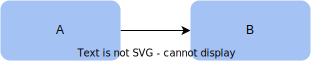
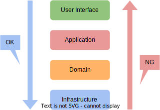
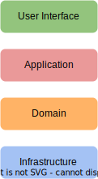
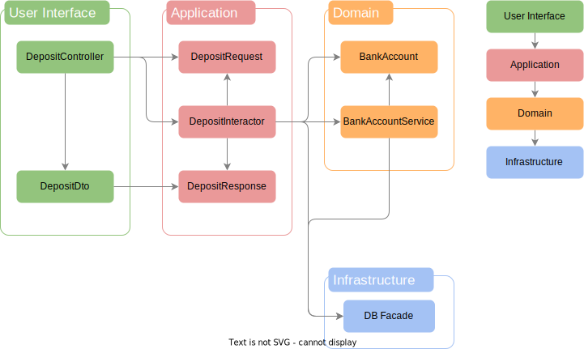
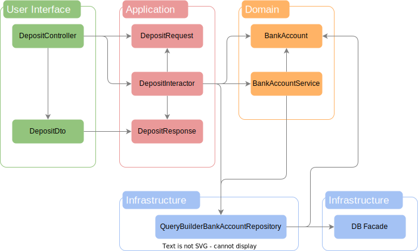
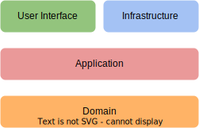
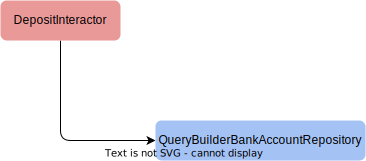
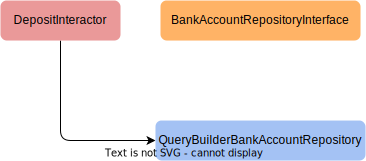
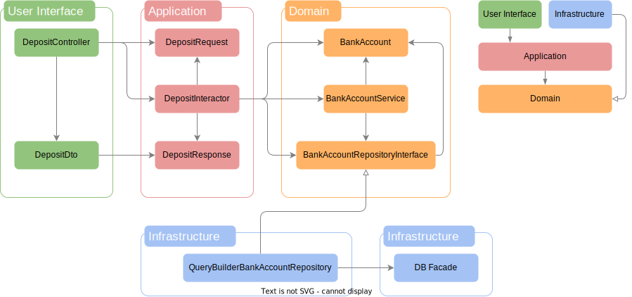

# 特定の技術に依存しない<br>アプリケーション設計入門

---
layout: section
slide_info: false
color: sky-light
---

# 依存とは

<!--
この後「依存」って言葉がいっぱい出てくるのでわかっているとは思いますが改めてざっくり説明します
-->

---
layout: center
slide_info: false
style: |
  background-color: #E9EFF5;
  color: #0ea5e9;
---

## あるオブジェクトが他のオブジェクトの振る舞いに頼っていること

---
layout: two-cols
slide_info: false
color: sky-light
---

:: left ::

```php
class A
{
    public function doSomething()
    {
        $b = new B();

        $b->call();
    }
}
```

:: right ::

```php
class B
{
    public function call()
    {
        ...
    }
}
```

---
layout: two-cols
slide_info: false
color: sky-light
---

:: left ::

```php{5,7}
class A
{
    public function doSomething()
    {
        $b = new B();

        $b->call();
    }
}
```

:: right ::

```php{3}
class B
{
    public function call()
    {
        ...
    }
}
```

<!--
クラス A はクラス B の振る舞いに頼っている
-->

---
color: sky-light
---

<div style="height: 100%; display: grid; place-items: center;">

# A は B に依存している



</div>

---
layout: section
slide_info: false
color: sky-light
---

# 具体例

---
slide_info: false
color: sky-light
---

```php{all|5,21|7,9,13|1,15-19|5,21,7,9,13,1,15-19|1,15-19}
use Illuminate\Support\Facades\DB;

class DepositInteractor
{
    public function handle(DepositRequest $request): DepositResponse
    {
        $bankAccountService = new BankAccountService();

        $accountNumber = new AccountNumber($request->accountNumber);

        $bankAccount = $bankAccountService->getBankAccount($accountNumber);

        $bankAccount->deposit(new Money($request->amount));

        DB::table('bank_accounts')
            ->updateOrInsert(
                ['account_number' => $bankAccount->accountNumber->value],
                ['balance' => $bankAccount->balance->value],
            );

        return new DepositResponse($request->accountNumber, $bankAccount->balance->value);
    }
}
```

<!--
DepositInteractor は

[click:1] DepositRequest/DepositResponse

[click:1] BankAccountService/AccountNumber/Money

[click:1] DB Facade 

に依存している

[click:1] 質が違うのは？

[click:1] 違うのはこれ

何かというと(次のスライド)
-->

---
layout: center
slide_info: false
style: |
  background-color: #E9EFF5;
  color: #0ea5e9;
---

# フレームワークに依存している

---
layout: section
slide_info: false
color: sky-light
---

# なにがよくないのか 🤔💭

<!--
考えてみよう(次のスライド)
-->

---
color: sky-light
---

# こんなことがあるかも

- ある日、フレームワーク/ライブラリが非推奨になった
- フレームワーク/ライブラリを更新したら互換性がなくてアプリケーションが壊れた
- データベースを移行したら SQL の文法が使えなくてエラーが起きた
- ライセンスが変わって使えなくなった

<!--
こういうことがあるとコードの更新が必要になる
-->

---
layout: center
slide_info: false
style: |
  background-color: #E9EFF5;
  color: #0ea5e9;
---

# 特定の技術がビジネスロジックに影響を及ぼす

<!--
フレームワークのバージョンを見てもらえると考えやすいと思いますが、特定の技術はとても変化が激しいものです

例) Laravel は年 1 でメジャーバージョンが上がる

変更が激しいということは(次のスライド)
-->

---
layout: center
slide_info: false
style: |
  background-color: #E9EFF5;
  color: #0ea5e9;
---

# 変更のたびに大きな負担がかかる

<!--
この負担を下げるために(次のスライド)
-->

---
layout: center
slide_info: false
style: |
  background-color: #E9EFF5;
  color: #0ea5e9;
---

# 特定の技術に依存しない設計を考える必要がある

---
color: sky-light
---

# 今回の目標

- 特定の技術からビジネスロジックを守る

---
color: sky-light
---

# 目標達成のための 3 ステップ

<br>

1. アーキテクチャ選定
2. DI(Dependency Injection)
3. DIP(Dependency Inversion Principle)

---
layout: section
slide_info: false
color: sky-light
---

# アーキテクチャ選定

---
color: sky-light
---

# アーキテクチャ

- レイヤードアーキテクチャ
- ヘキサゴナルアーキテクチャ
- オニオンアーキテクチャ
- etc...

<!--
アーキテクチャ選定といってもレイヤード、ヘキサゴナル、オニオン、などなどいろいろあって何を選んだらいいかわかりませんよね

なので今回はシンプルなレイヤードアーキテクチャをベースに考えます
-->

---
layout: section
slide_info: false
color: sky-light
---

# レイヤードアーキテクチャ

---
slide_info: false
color: sky-light
---



<!--
責務を各層に分担させて、依存関係を明確にしたものです

下層への依存のみを許可しています

下層であれば層を飛ばしても問題ありません

例: Application 層が直接 Infrastructure 層に依存する
-->

---
color: sky-light
---

# User Interface 層

- 入出力を担当する
  - ユーザーから受け取った値のバリデーションや整形して Application 層に処理を委譲したり
  - Application 層からの返り値を出力用に整形したり
- 例
  - Controller
  - Presenter
  - ViewModel
  - etc...

---
color: sky-light
---

# Application 層

- ビジネスロジックを担当
- Domain 層を利用してユースケースの実現をする
- **POPO(Plain Old PHP Object)** にする

<!--
POPO とは

PHP の基本的な機能を使ってオブジェクトのこと

特定のライブラリやフレームワークに依存しないもの

例) DateTime はいいけど、Carbon はだめ
-->

---
color: sky-light
---

# Domain 層

- ビジネスロジックを担当
- 対象領域の知識(ドメイン知識)を実現
- 例
  - ドメインオブジェクト
  - ドメインサービス
- **POPO(Plain Old PHP Object)** にする

<!--
ドメインオブジェクト、ドメインサービスは DDD で調べてもらえるとよい
-->

---
color: sky-light
---

# Infrastructure 層

- 具体的な実装を置く層
  - データ永続化
  - 外部 API との通信
  - フレームワークやライブラリ
- 例
  - Repository
  - ORM
  - etc...

---
layout: center
slide_info: false
style: |
  background-color: #E9EFF5;
  color: #0ea5e9;
---

# https://github.com/sayuprc-learning/bank-account

<!--
今日話すコードは GitHub に上がっています

スライドではスペースの都合上省略しているコードがあるので、もしよかったらリンクからコードを読んでみてください

簡易的な銀行口座の管理システムをベースに話を進めていきます
-->

---
slide_info: false
color: sky-light
---




```php{all|4|5}
class BankAccount
{
    public function __construct(
        public readonly AccountNumber $accountNumber,
        private(set) Balance $balance,
    ) {
    }

    public function deposit(Moeny $amount): void
    {
        $this->balance = $this->balance->add($amount);
    }

    public function withdraw(Moeny $amount): void
    {
        $this->balance = $this->balance->subtract($amount);
    }
}
```

<!--
口座を表すクラス

[click:1] 口座番号と

[click:1] 残高を持っている
-->

---
slide_info: false
color: sky-light
---


```php
class BankAccountService
{
    public function getBankAccount(AccountNumber $accountNumber): BankAccount
    {
        $found = DB::table('bank_accounts')
            ->where('account_number', $accountNumber->value)
            ->first();

        if (is_null($found)) {
            throw new Exception('口座が存在しません: ' . $accountNumber->value);
        }

        return new BankAccount($accountNumber, new Balance($found->balance));
    }
}
```

<!--
ドメインサービスと呼ばれるクラスで、Entity や ValueObject で表現するには不自然なものを表現するものです

話がそれてしまうので今回詳しくは話しません

興味がある人はドメインサービスで調べてみてください

このクラスでは口座番号をもとに口座を検索するメソッドを実装しています
-->

---
slide_info: false
color: sky-light
---


```php{all|3,7|9|11|13-17|19}
class DepositInteractor
{
    public function handle(DepositRequest $request): DepositResponse
    {
        $bankAccountService = new BankAccountService();

        $accountNumber = new AccountNumber($request->accountNumber);

        $bankAccount = $bankAccountService->getBankAccount($accountNumber);

        $bankAccount->deposit(new Money($request->amount));

        DB::table('bank_accounts')
            ->updateOrInsert(
                ['account_number' => $bankAccount->accountNumber->value],
                ['balance' => $bankAccount->balance->value],
            );

        return new DepositResponse($request->accountNumber, $bankAccount->balance->value);
    }
}
```

<!--
預入処理の実装です

[click:1] 預入に必要な入力値から

[click:1] 対象の口座を取得

[click:1] 口座に対して入金処理して

[click:1] データを保存

[click:1] 最終的な出力の形式を返す
-->

---
slide_info: false
color: sky-light
---


```php{13-17}
class DepositInteractor
{
    public function handle(DepositRequest $request): DepositResponse
    {
        $bankAccountService = new BankAccountService();

        $accountNumber = new AccountNumber($request->accountNumber);

        $bankAccount = $bankAccountService->getBankAccount($accountNumber);

        $bankAccount->deposit(new Money($request->amount));

        DB::table('bank_accounts')
            ->updateOrInsert(
                ['account_number' => $bankAccount->accountNumber->value],
                ['balance' => $bankAccount->balance->value],
            );

        return new DepositResponse($request->accountNumber, $bankAccount->balance->value);
    }
}
```

<!--
DB Facade 自体が Infrastructure 層に属するのコードになります
-->

---
slide_info: false
color: sky-light
---


```php{5-7}
class BankAccountService
{
    public function getBankAccount(AccountNumber $accountNumber): BankAccount
    {
        $found = DB::table('bank_accounts')
            ->where('account_number', $accountNumber->value)
            ->first();

        if (is_null($found)) {
            throw new Exception('口座が存在しません: ' . $accountNumber->value);
        }

        return new BankAccount($accountNumber, new Balance($found->balance));
    }
}
```

<!--
こちらも同様に DB Facade が Infrastructure 層に属するコードです
-->

---
slide_info: false
color: sky-light
---


```php{all|5-8|10-13|15|17}
class DepositController extends Controller
{
    public function handle(Request $request): JsonResponse
    {
        $validated = $request->validate([
            'account_number' => ['required', 'regex:/\A\d{8}\z/'],
            'amount' => ['required', 'integer', 'min:1'],
        ]);

        $accountNumber = $validated['account_number'];
        $amount = (int)$validated['amount'];

        $outputData = new DepositInteractor()->handle(new DepositRequest($accountNumber, $amount));

        $response = new DepositDto()->present($outputData);

        return response()->json($response);
    }
}
```

<!--
最後に User Interface 層です

[click:1] ユーザーからの値をバリデーションして

[click:1] Application 層ように入力値を整形し、処理を委譲

[click:1] API の表示用クラスに実行結果を渡して整形し

[click:1] JSON 形式のレスポンスを返す
-->

---
slide_info: false
color: sky-light
---


```php
class DepositDto
{
    public function present(DepositResponse $outputData): array
    {
        return [
            'account_number' => $outputData->accountNumber,
            'balance' => $outputData->balance,
        ];
    }
}
```

<!--
Application 層の出力を用いて、User Interface 層に応じた出力の形を作る

今回の場合はシンプルに値をそのまま出力するだけですが、日付や数値のフォーマットは必要に応じてここで行うことがあります
-->

---
slide_info: false
color: sky-light
---



<!--
今説明したコードの関係図がこちらになります

先ほど説明した通り

1. User Interface 層
2. Application 層
3. Domain 層
4. Infrastructure 層

の順に依存しているのが分かると思います

ですが、このアーキテクチャにはいくつかの問題点があります

それは(次のスライド)
-->

---
color: sky-light
---

# 問題点

- 密結合
  - テスタビリティが低い
  - 変更に弱い
- 詳細な実装(Infrastructure 層)に依存している

<!--
1. 密結合であること
密結合だとテストがしづらく、依存しているオブジェクトに変更があったときその影響をもろに受けることになります

2. Infrastructure 層に依存していること
レイヤードアーキテクチャとしては、この依存の向きは問題ないのですが、今回は変化しやすい技術に依存しない設計を目標としているためこれはとても大きな問題となります

これらの問題点を解決するために(次のスライド)
-->

---
layout: section
slide_info: false
color: sky-light
---

# DI(Dependency Injection)

---
color: sky-light
---

# DI(Dependency Injection) とは

依存オブジェクト(Dependency)を外部から注入(Injection)する設計のこと

---
color: sky-light
---

# メリット

- テスタビリティが向上
  - モックを使ったテストができるようになる
- 結合度を下げられる

詳しくは <span style="color: #0ea5e9;">[DI(Dependency Injection)は何がうれしいのか](https://zenn.dev/sayu/articles/26eb5d5cea9540)</span> 読んでね

---
slide_info: false
color: sky-light
---


```php
class QueryBuilderBankAccountRepository
{
    public function find(AccountNumber $accountNumber): ?BankAccount
    {
        $found = DB::table('bank_accounts')
            ->where('account_number', $accountNumber->value)
            ->first();

        if (is_null($found)) {
            return null;
        }

        return new BankAccount($accountNumber, new Balance($found->balance));
    }

    public function save(BankAccount $bankAccount): void
    {
        DB::table('bank_accounts')
            ->updateOrInsert(
                ['account_number' => $bankAccount->accountNumber->value],
                ['balance' => $bankAccount->balance->value],
            );
    }
}
```

<!--
Application 層、Domain 層に散らばっていた DB Facade のコードを QueryBuilderBankAccountRepository にまとめました

そしてこれを Infrastructure 層として定義します
-->

---
slide_info: false
color: sky-light
---


````md magic-move
```php
class DepositInteractor
{
    public function handle(DepositRequest $request): DepositResponse
    {
        $bankAccountService = new BankAccountService();

        $accountNumber = new AccountNumber($request->accountNumber);

        $bankAccount = $bankAccountService->getBankAccount($accountNumber);

        $bankAccount->deposit(new Money($request->amount));

        DB::table('bank_accounts')
            ->updateOrInsert(
                ['account_number' => $bankAccount->accountNumber->value],
                ['balance' => $bankAccount->balance->value],
            );

        return new DepositResponse($request->accountNumber, $bankAccount->balance->value);
    }
}
```
```php{3-7,15,19}
class DepositInteractor
{
    public function __construct(
        private readonly QueryBuilderBankAccountRepository $bankAccountRepository,
        private readonly BankAccountService $bankAccountService,
    ) {
    }

    public function handle(DepositRequest $request): DepositResponse
    {
        if ($request->amount < 1) {
            throw new Exception('入金額は 1 以上である必要があります');
        }

        $bankAccount = $this->bankAccountService->getBankAccount(new AccountNumber($request->accountNumber));

        $bankAccount->deposit(new Money($request->amount));

        $this->bankAccountRepository->save($bankAccount);

        return new DepositResponse($request->accountNumber, $bankAccount->balance->value);
    }
}
```
````

<!--
いままで DB Facade に直接依存していたコードは

[click:1] コンストラクタで先ほど作ったリポジトリを受取るようにし、そこからメソッドを呼ぶ形にします
-->

---
slide_info: false
color: sky-light
---


````md magic-move
```php
class BankAccountService
{
    public function getBankAccount(AccountNumber $accountNumber): BankAccount
    {
        $found = DB::table('bank_accounts')
            ->where('account_number', $accountNumber->value)
            ->first();

        if (is_null($found)) {
            throw new Exception('口座が存在しません: ' . $accountNumber->value);
        }

        return new BankAccount($accountNumber, new Balance($found->balance));
    }
}
```
```php{3-6,10}
class BankAccountService
{
    public function __construct(
        private readonly QueryBuilderBankAccountRepository $bankAccountRepository,
    ) {
    }

    public function getBankAccount(AccountNumber $accountNumber): BankAccount
    {
        $found = $this->bankAccountRepository->find($accountNumber);

        if (is_null($found)) {
            throw new Exception('口座が存在しません: ' . $accountNumber->value);
        }

        return $found;
    }
}
```
````

<!--
[click:1] ドメインサービスも同様にコンストラクタにリポジトリを渡すようにします

依存しているオブジェクトをコンストラクタの引数として渡すことで、外部からモックを渡せるようになるので、テスタビリティが向上します

今回はコンストラクタに渡していますが、メソッドの引数に渡す方法もあります

これらはそれぞれコンストラクタインジェクション,メソッドインジェクションと呼ばれます

DI によってテスタビリティは向上しましたが、まだ次のような問題が残っています(次のスライド)
-->

---
slide_info: false
color: sky-light
---



<!--
ここまでのコードの関係図はこのようになっています

新たにリポジトリが生えたことによって、Application 層や Domain 層が直接 DB Facade に依存することはなくなりました
-->

---
color: sky-light
---

# 問題点

- 密結合
  - ~~テスタビリティが低い~~
  - 変更に弱い
- 詳細な実装(Infrastructure 層)に依存している
- Infrastructure 層が Domain 層に依存している <span style="color: #F43F5E;"><- New!</span>

<!--
DI だけではテスタビリティ以外の問題を解決することはできません

むしろ新たに Infrastructure 層が Domain 層に依存してしまうという問題が発生しています

これらの問題を解決するにはインフラ層を何とか上に持っていきたい(次のスライド)
-->

---
slide_info: false
color: sky-light
---



<!-- 
この形にするために次のステップに進む
-->

---
layout: section
slide_info: false
color: sky-light
---

## DIP(Dependency Inversion Principle)

---
color: sky-light
---

# DIP(Dependency Inversion Principle) とは

a. 上位のモジュールは下位のモジュールに依存してはならない。どちらのモジュールも「抽象」に依存すべきである。

b.「抽象」は実装の詳細に依存してはならない。実装の詳細が「抽象」に依存すべきである。

---
color: sky-light
---

# DIP(Dependency Inversion Principle) とは

a. 上位のモジュールは下位のモジュールに依存してはならない。どちらのモジュールも「抽象」に依存すべきである。

<span style="opacity: .5;">b.「抽象」は実装の詳細に依存してはならない。実装の詳細が「抽象」に依存すべきである。</span>

<!--
上位のモジュール: ビジネスロジックのモジュール

下位のモジュール: 特定の技術のモジュール
-->

---
slide_info: false
color: sky-light
---

```php{1,4}
class DepositInteractor
{
    public function __construct(
        private readonly QueryBuilderBankAccountRepository $bankAccountRepository,
    ) {
    }

    public function handle(DepositRequest $request): DepositResponse
    {
        ...
    }
}
```

---
slide_info: false
color: sky-light
---



---
slide_info: false
color: sky-light
---

<SpeechBubble position="l" color="red-light" shape="round" style="position: absolute; left: 370px; top: 100px;">

上位モジュール
</SpeechBubble>

<SpeechBubble position="b" color="indigo-light" shape="round" style="position: absolute; left: 600px; top: 280px;">

下位モジュール
</SpeechBubble>


<!--
この状態は DIP に違反している
-->

---
slide_info: false
color: sky-light
---


```php
interface BankAccountRepositoryInterface
{
    public function find(AccountNumber $accountNumber): ?BankAccount;

    public function save(BankAccount $bankAccount): void;
}
```

<!--
ここから関係性を逆転させるために、Domain 層に BankAccountRepositoryInterface を作成します
-->

---
slide_info: false
color: sky-light
---



---
slide_info: false
color: sky-light
---

````md magic-move
```php{1}
class QueryBuilderBankAccountRepository
{
    public function find(AccountNumber $accountNumber): ?BankAccount
    {
        ...
    }

    public function save(BankAccount $bankAccount): void
    {
        ...
    }
}
```
```php{1}
class QueryBuilderBankAccountRepository implements BankAccountRepositoryInterface
{
    public function find(AccountNumber $accountNumber): ?BankAccount
    {
        ...
    }

    public function save(BankAccount $bankAccount): void
    {
        ...
    }
}
```
````

<!--
[click:1] QueryBuilderBankAccountRepository は BankAccountRepositoryInterface を実装するように
-->

---
slide_info: false
color: sky-light
---

````md magic-move
```php{1,4}
class DepositInteractor
{
    public function __construct(
        private readonly QueryBuilderBankAccountRepository $bankAccountRepository,
    ) {
    }

    public function handle(DepositRequest $request): DepositResponse
    {
        ...
    }
}
```
```php{1,4}
class DepositInteractor
{
    public function __construct(
        private readonly BankAccountRepositoryInterface $bankAccountRepository,
    ) {
    }

    public function handle(DepositRequest $request): DepositResponse
    {
        ...
    }
}
```
````

<!--
[click:1] DepositInteractor は BankAccountRepositoryInterface に依存するように書き換えます
-->

---
slide_info: false
color: sky-light
---


<!--
上位モジュールと下位モジュールがどちらも抽象に依存した
-->

---
color: sky-light
---

# DIP(Dependency Inversion Principle) とは

<span style="opacity: .5;">a. 上位のモジュールは下位のモジュールに依存してはならない。どちらのモジュールも「抽象」に依存すべきである。</span>

b.「抽象」は実装の詳細に依存してはならない。実装の詳細が「抽象」に依存すべきである。

<!--
こちらは今回のコードで説明するのは難しいのでざっくり説明になります
-->

---
slide_info: false
color: sky-light
---

<SpeechBubble position="l" color="red-light" shape="round" style="z-index: 100; position: absolute; left: 250px; top: 20px;">

抽象
</SpeechBubble>

```php{1}
class DepositInteractor
{
    public function __construct(
        private readonly QueryBuilderBankAccountRepository $bankAccountRepository,
    ) {
    }

    public function handle(DepositRequest $request): DepositResponse
    {
        ...
    }
}
```

---
slide_info: false
color: sky-light
---

<SpeechBubble position="l" color="red-light" shape="round" style="z-index: 100; position: absolute; left: 250px; top: 20px;">

抽象
</SpeechBubble>

<SpeechBubble position="t" color="indigo-light" shape="round" style="z-index: 100; position: absolute; left: 250px; top: 130px;">

実装の詳細
</SpeechBubble>

```php{1,4}
class DepositInteractor
{
    public function __construct(
        private readonly QueryBuilderBankAccountRepository $bankAccountRepository,
    ) {
    }

    public function handle(DepositRequest $request): DepositResponse
    {
        ...
    }
}
```

---
slide_info: false
color: sky-light
---

<SpeechBubble position="l" color="red-light" shape="round" style="z-index: 100; position: absolute; left: 250px; top: 20px;">

抽象
</SpeechBubble>

<SpeechBubble position="t" color="amber-light" shape="round" style="z-index: 100; position: absolute; left: 250px; top: 130px;">

抽象
</SpeechBubble>

```php{1,4}
class DepositInteractor
{
    public function __construct(
        private readonly BankAccountRepositoryInterface $bankAccountRepository,
    ) {
    }

    public function handle(DepositRequest $request): DepositResponse
    {
        ...
    }
}
```

---
slide_info: false
color: sky-light
---

<SpeechBubble position="t" color="indigo-light" shape="round" style="z-index: 100; position: absolute; left: 150px; top: 80px;">

実装の詳細
</SpeechBubble>

```php{1}
class QueryBuilderBankAccountRepository implements BankAccountRepositoryInterface
{
    public function find(AccountNumber $accountNumber): ?BankAccount
    {
        ...
    }

    public function save(BankAccount $bankAccount): void
    {
        ...
    }
}
```

---
slide_info: false
color: sky-light
---

<SpeechBubble position="t" color="indigo-light" shape="round" style="z-index: 100; position: absolute; left: 150px; top: 80px;">

実装の詳細
</SpeechBubble>

<SpeechBubble position="t" color="amber-light" shape="round" style="z-index: 100; position: absolute; left: 370px; top: 80px;">

抽象
</SpeechBubble>

```php{1}
class QueryBuilderBankAccountRepository implements BankAccountRepositoryInterface
{
    public function find(AccountNumber $accountNumber): ?BankAccount
    {
        ...
    }

    public function save(BankAccount $bankAccount): void
    {
        ...
    }
}
```

---
slide_info: false
color: sky-light
---


---
color: sky-light
---

# メリット

- 変更に強くなる
  - 実装の詳細の変更に関して、ビジネスロジックは影響を受けなくなる
- 柔軟性の向上
  - 挿げ替えが容易かつ安全に行える

<!--
ビジネスロジックが抽象に依存するので、実装の詳細に変更があってもビジネスロジックは影響を受けなくなります

また、実装の詳細は抽象に依存しているので挿げ替えも容易になります
-->

---
slide_info: false
color: sky-light
---



<!--
DIP にした後のコードの関係図です

依存の矢印も正常になり、Application 層と Domain 層が他の層に影響を受けなくなりました
-->

---
color: sky-light
---

# 問題点

- ~~密結合~~
  - ~~テスタビリティが低い~~
  - ~~変更に弱い~~
- ~~詳細な実装(Infrastructure 層)に依存している~~
- ~~Infrastructure 層が Domain 層に依存している~~

---
layout: center
slide_info: false
style: |
  background-color: #E9EFF5;
  color: #0ea5e9;
---

# 👏

---
color: sky-light
---

# まとめ

- レイヤードアーキテクチャ
  - 各層の責務/依存関係を明確に
- DI
  - テストしやすく
- DIP
  - 依存関係を理想の形に
  - 変更に強く
  - 拡張しやすく
  - 開発もしやすい

---
layout: section
slide_info: false
color: sky-light
---

# さいごに

---
layout: center
slide_info: false
style: |
  background-color: #E9EFF5;
  color: #0ea5e9;
---

# アーキテクチャはアプリケーションの動作に寄与しない

---
layout: center
slide_info: false
style: |
  background-color: #E9EFF5;
  color: #0ea5e9;
---

# 特に深く考えなくても開発はできるし<br>アプリケーションは動く

<!--
ですが(次のスライド)
-->

---
layout: center
slide_info: false
style: |
  background-color: #E9EFF5;
  color: #0ea5e9;
---

# 誰かの苦労のもとに成り立っている

<!--
誰かが泣きながら修正したりしてるんです

それは全くの他人かもしれないし、将来の自分かもしれません
-->

---
layout: center
slide_info: false
style: |
  background-color: #E9EFF5;
  color: #0ea5e9;
---

# できるだけ苦労しないように

---
layout: center
slide_info: false
style: |
  background-color: #E9EFF5;
  color: #0ea5e9;
---

# アーキテクトしよう

---
color: sky-light
---

# 参考

- [ADOP (Application Domain Others Pattern)](https://nrslib.com/adop/)
- [WEB アプリケーション設計入門 / Introduction to web application design](https://speakerdeck.com/nrslib/introduction-to-web-application-design)
- [依存関係のコントロール / Dependency Control](https://speakerdeck.com/nrslib/dependency-control)

<div style="display: flex;">
  <Youtube id="UTKJ-Lgn3aI" />

  <Youtube id="0Y7ew4FHdO4" />
</div>

<!--
今回の話で言いたいことはすべてこの記事や動画にあります

興味が出た人はぜひ見てみてください
-->
