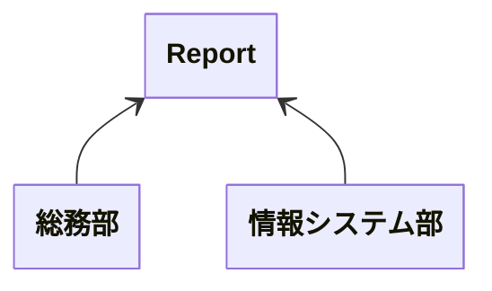
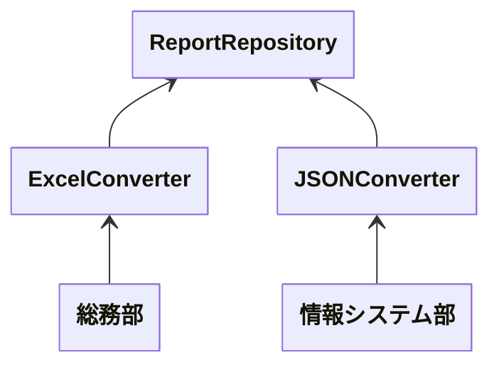

# SOLID 原則<br>単一責任の原則(SRP)

___
<br>

### Single Responsibility Principle

---

# SOLID 原則とは

ソフトウェア設計時に従うべき 5 つのガイドラインのこと

- Single Responsibility Principle(SRP)
- Open Closed Principle(OCP)
- Liskov Substitution Principle(LSP)
- Interface Segregation Principle(ISP)
- Dependency Inversion Principle(DIP)

---

# SOLID 原則の目的

- 変更に強い
- 可読性
- 再利用性
- 汎用性
- モジュール性

---

# SOLID 原則とは(再掲)

ソフトウェア設計時に従うべき 5 つのガイドラインのこと

- Single Responsibility Principle(SRP)
- <span class="gray-out">Open Closed Principle(OCP)</span>
- <span class="gray-out">Liskov Substitution Principle(LSP)</span>
- <span class="gray-out">Interface Segregation Principle(ISP)</span>
- <span class="gray-out">Dependency Inversion Principle(DIP)</span>

<style>
  .gray-out {
    color: rgba(255, 255, 255, .3);
  }
</style>

---
layout: center
---

# 単一責任の原則(SRP)

---
layout: center
---

## 🤔クラスとか関数とかは 1 つのことだけをやればいいってことでしょ？

<!--
この意識自体は正しいが、これはでかい関数を分けたときの最下位のレベルに使う原則

SRP では次のことを定義としている
-->

---
layout: quote
---

# 定義

> モジュールはたったひとつのアクターに対して責務を負うべき

---
layout: center
---

# 🤔モジュール？アクター？

---
layout: quote
---

# モジュールとは

> ソースファイルもしくはいくつかの関数やデータをまとめた凝集性のあるもの

<p class="text-xs">凝集性: ロジックとデータが共通の目的を達成するために協調しているかを示す度合い</p>

<!--
ロジックと関係ないデータを持っていたり、その逆のコードがある場合、凝集性が低いといえる
-->

---
layout: two-cols
---

# 凝集度の例

```php
class User {
    public function save() {
        // DB への保存をするロジック
    }

    public function sendMail() {
        // メールを送信するロジック
    }

    public function calcCart() {
        // カート内の金額を計算するロジック
    }
}
```

::right::

<h1 style="color: rgba(0, 0, 0, 0);">_</h1>

```php
class User {
}

class UserRepository {
    public function save(User $user) {
        // DB への保存をするロジック
    }
}

class SendMailService {
    public function send() {
        // メールを送信するロジック
    }
}

class CartCalculator {
    public function handle(Collection $item) {
        // カート内の金額を計算するロジック
    }
}
```

<!--
左側のコードが凝集度が低いコード

User クラスにいろんな処理が混じっている

一方右側のコードは、それぞれのクラスに分かれている
-->

---
layout: quote
---

# アクターとは

> ソフトウェアシステムに手を加えるのは、ユーザーやステークホルダーを満足させるため
> 
> この「ユーザーやステークホルダー」こそが、単一責任の原則（SRP）が指す「変更する理由」
> 
> 変更を望む人たちをひとまとめにしたグループとして扱い、これをアクターと呼ぶ

<!--
ユーザーやステークホルダーだけでなく、依存しているプログラムも含む
-->

---
layout: center
---

# 要するに

---
layout: center
---

# アクターが異なる場合はクラスを分割しよう

---
layout: two-cols
---

# 良くない例



::right::


```php{all|2-4|6-8|10-12}
class Report {
    public function fetch() {
        // データ取得処理
    }

    public function toExcel() {
        // Excel 出力処理
    }

    public function toJSON() {
        // JSON 出力処理
    }
}
```

<!--
何らかのレポートを出力する機能があるとする  
利用する部署によって出力後の使い方が異なる  
それにより出力形式もそれぞれの部署に合わせる必要がある
-->

---

# どこが良くないのか

- 複数の責務を持っている
  - データの取得
  - Excel 出力
  - JSON 出力
- 変更を依頼するアクターが複数存在している
  - データの取得方法が変わる
  - 出力データの構造が変わる(Excel/JSON)

<!--
- データの取得先変更
  - RDB のライセンスが変わって使えなくなった
  - RDB -> DWH から取得するようにしたい
  - 要件を満たせなくなったから別のサービスに乗り換える
- Excel の形式を変えたい
- JSON の形式を変えたい
など
-->

---

# 複数の責務を持つと何が良くないのか

- 凝集度の低下
- テストの複雑化
- 依存関係の複雑化
- 再利用性の低下
- 影響範囲の拡大

---
layout: two-cols
---

# 良い実装例



::right::

```php{all|1-5|7-11|12-17}
class ReportRepository {
    public function fetch() {
        // データ取得処理
    }
}

class ExcelConverter {
    public function handle() {
        // Excel 出力処理
    }
}

class JSONConverter {
    public function handle() {
        // JSON 出力処理
    }
}
```

<!--
データの取得は ReportRepository  
Excel 出力は ExcelConverter  
JSON 出力は JSONConverter  
それぞれに役割を分担すると同時に、変更依頼してくるアクターも振り分けられる
-->

---

# メリット

- 凝集度が上がる
  - 認知負荷は下がる
- 変更箇所が最小になる
  - 変更による影響範囲が狭くなる
- 拡張性が向上する

---

# どうやったらいいか

- 責務を意識する
- アクターを意識する
- 分割を恐れない

---

# まとめ

- アクターが異なる場合はクラスを分割しよう
- 分割することでうれしいことが増えるよ

---

# 参考

- Clean Architecture 達人に学ぶソフトウェアの構造と設計 
