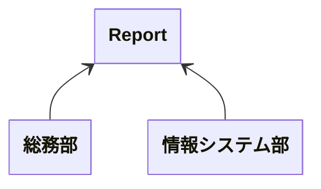
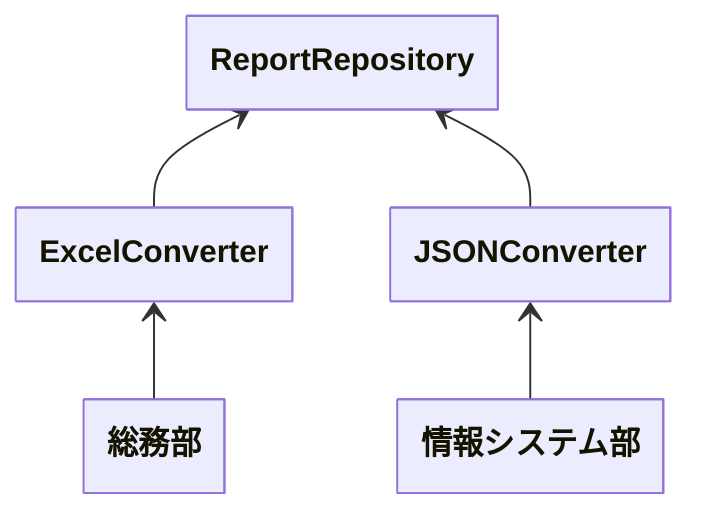

# SOLID 原則<br>単一責任の原則(SRP)

___
<br>

### Single Responsibility Principle

---

# SOLID 原則とは

OOP において、ソフトウェア設計時に従うべき 5 つのガイドラインのこと

<v-click>
  <Arrow x1="400" y1="153" x2="330" y2="153" />
  <span style="position: absolute; top: 155; left: 405px;">今回はこれの話</span>
</v-click>

- Single Responsibility Principle
- Open Closed Principle
- Liskov Substitution Principle
- Interface Segregation Principle
- Dependency Inversion Principle

---
layout: quote
---

# 単一責任の原則(SRP)

> モジュールはたったひとつのアクターに対して責務を負うべき

---
layout: quote
---

# モジュールとは

> ソースファイルもしくはいくつかの関数やデータをまとめた凝集性のあるもの

<p class="text-xs">凝集性: ロジックとデータが共通の目的を達成するために協調しているかを示す度合い</p>

---
layout: quote
---

# アクターとは

> ソフトウェアシステムに手を加えるのは、ユーザーやステークホルダーを満足させるため
> 
> この「ユーザーやステークホルダー」こそが、単一責任の原則（SRP）が指す「変更する理由」
> 
> 変更を望む人たちをひとまとめにしたグループとして扱い、これをアクターと呼ぶ

<!--
ユーザーやステークホルダーだけでなく、依存しているプログラムも含む
-->

---
layout: center
---

# 要するに

---
layout: center
---

# アクターが異なる場合はクラスを分割しよう

---
layout: two-cols
---

# 良くない例



::right::


```php{all|2-4|6-8|10-12}
class Report {
    public function fetch() {
        // データ取得処理
    }

    public function toExcel() {
        // Excel 出力処理
    }

    public function toJSON() {
        // JSON 出力処理
    }
}
```

<!--
何らかのレポートを出力する機能があるとする  
利用する部署によって出力後の使い方が異なる  
それにより出力形式もそれぞれの部署に合わせる必要がある
-->

---

# どこが良くないのか

- 複数の責務を持っている
  - データの取得
  - Excel 出力
  - JSON 出力
- 変更を依頼するアクターが複数存在している
  - データの取得方法が変わる
  - 出力データの構造が変わる(Excel/JSON)

<!--
- データの取得先変更
  - RDB のライセンスが変わって使えなくなった
  - RDB -> DWH から取得するようにしたい
  - 要件を満たせなくなったから別のサービスに乗り換える
- Excel の形式を変えたい
- JSON の形式を変えたい
など
-->

---

# 複数の責務を持つと何が良くないのか

- 凝集度の低下
- テストの複雑化
- 依存関係の複雑化
- 再利用性の低下
- 影響範囲の拡大

---
layout: two-cols
---

# 良い実装例



::right::

```php{all|1-5|7-11|12-17}
class ReportRepository {
    public function fetch() {
        // データ取得処理
    }
}

class ExcelConverter {
    public function handle() {
        // Excel 出力処理
    }
}

class JSONConverter {
    public function handle() {
        // JSON 出力処理
    }
}
```

<!--
データの取得は ReportRepository  
Excel 出力は ExcelConverter  
JSON 出力は JSONConverter  
それぞれに役割を分担すると同時に、変更依頼してくるアクターも振り分けられる
-->

---

# メリット

- 凝集度が上がる
  - 認知負荷は下がる
- 変更箇所が最小になる
  - 変更による影響範囲が狭くなる
- 拡張性が向上する

---

# どうやったらいいか

- 責務を意識する
- アクターを意識する
- 分割を恐れない

---

# まとめ

- アクターが異なる場合はクラスを分割しよう
- 分割することでうれしいことが増えるよ

---

# 参考

- Clean Architecture 達人に学ぶソフトウェアの構造と設計 
